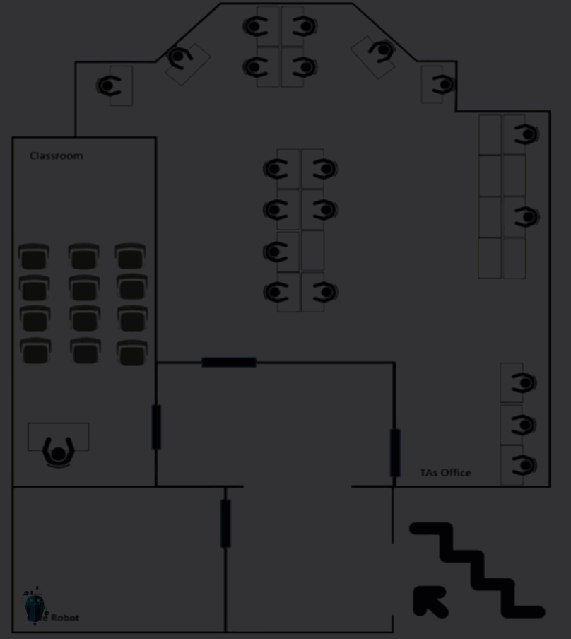
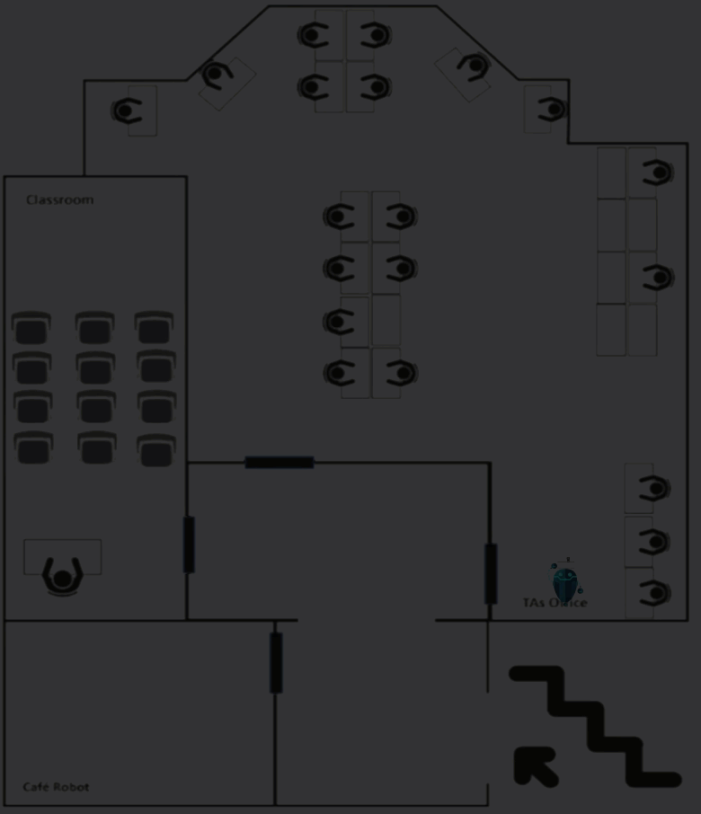

# cafe-robot-pathfinding-visualized

This project visualizes different pathfinding algorithms. It's written in Python and uses the Tkinter library for the GUI.

## Usage

### [`main.py`](main.py)

This is the entry point of the application. It initializes the GUI and sets up the grid for the pathfinding visualization.

### [`algorithms.py`](algorithms.py)

This file contains the implementation of the pathfinding algorithms. It includes functions for A-star and Breadth-First algorithms, as well as functions for traversing and visualizing the path.

### [`Spot.py`](Spot.py)

This file defines the `Spot` class, which represents a spot on the grid. Each spot has attributes like its position, its neighbors, and whether it's a start, end, obstacle, or door spot.

### [`Presets.py`](Presets.py)

This file contains the `Presets` class, which is used to build and load presets for the grid.

### [`globals.py`](globals.py)

This file initializes global variables and functions used across the application.

## Phase 1
Description of phase 1 can be found in [phase 1's project document]("./Project Scenario And Design/Phase 1/Ashraf 196280 - Café Robot (Assignment 1).pdf")

## Phase 2
Description of phase 1 can be found in [phase 2's project document]("./Project Scenario And Design/Phase 2/Ashraf 196280 - Café Robot (Assignment 2).pdf")

.gif)

.gif)

## Authors
- Your Name

## License
This project is licensed under the MIT License - see the [LICENSE.md](LICENSE.md) file for details
